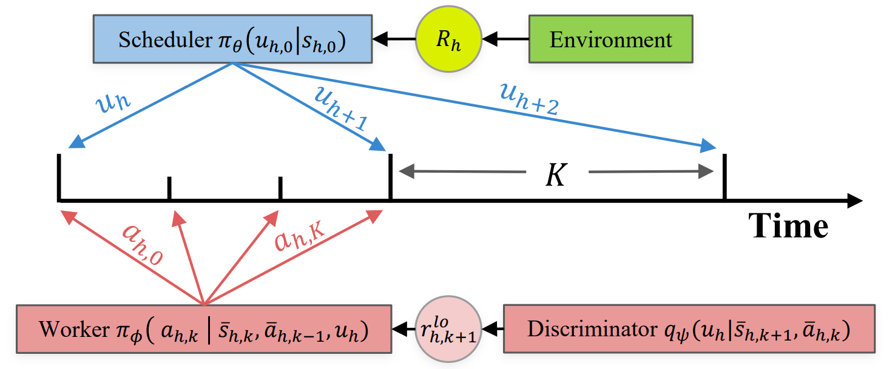

# Hierarchical Reinforcement Learning by Discovering Intrinsic Options (HIDIO)
 

This is the repository for our work, [Hierarchical Reinforcement Learning by Discovering Intrinsic Options (HIDIO)](), appearing in ICLR 2021. HIDIO is a  hierarchical RL algorithm which discovers short-horizon options in a self-supervised manner while jointly learning to utilize them to solve *sparse-reward* manipulation and navigation tasks. See our paper for more details.  TODO: Fill in link.

Our code imports an unmodified commit from the [Agent Learning Framework (ALF)](https://github.com/HorizonRobotics/alf/) developed by [Horizon Robotics](https://en.horizon.ai/), which includes parallelized PyTorch implementations of a wide variety of common reinforcement learning algorithms.

## Example HIDIO Behavior


## Installation
This repo was developed with Python 3.6.
You can run the following commands to install the hidio repo and its ALF dependency. 
```
git clone https://github.com/jesbu1/hidio
cd hidio
pip install -e .
```

In order to run on the SocialRobot environments (GoalTask/KickBall), you must 
have SocialRobot installed. If you want to test out these environments, follow
the steps listed in [this specific branch of our SocialRobot repo](https://github.com/jesbu1/SocialRobot/tree/distractor_kickball).

In order to run the Pusher/Reacher environments, you must have MuJoco 200 installed with an appropriate MuJuco license linked.
See here to download and setup MuJoco 200: [mujoco](https://www.roboti.us/index.html). On Ubuntu, we had to install some extra packages first: `sudo apt install -y libosmesa6-dev libgl1-mesa-glx libglfw3 patchelf`. Then, run
```
pip install mujoco-py==2.0.2.13
```

## Running Experiments
All experiments are run with 10 or 20 parallel actors. A sufficiently powerful computer may be required to run these examples.
#### HIDIO
Experiments for Pusher/Reacher can be run as follows:

```
cd hidio/examples
python -m alf.bin.train --gin_file hierarchical_[pusher/reacher].gin --root_dir=LOG_DIR
```
where LOG_DIR is the directory you want to store the training results. If LOG_DIR is an existing directory, training will be automatically resumed from the latest previous checkpoint stored there if it exists.

Experiments for GoalTask/KickBall can be run with the following command:

```
cd hidio/examples
python -m alf.bin.train --gin_file hierarchical_[goaltask/kickball].gin --root_dir=LOG_DIR
```

By default, Pusher/Reacher/GoalTask will use the `StateAction` instantiation of HIDIO, while KickBall will use the `StateDiff` instantiation. To change these, modify the `Discriminator.skill_type` flag to be the HIDIO instantiation you'd like to test out (options: `state_action/state_difference/action/state/state_concatenation/action_concatenation`).

#### SAC/SAC with Action Repetition

You can also run experiments for SAC/SAC with action repetition by replacing `hierarchical` in the commands above with `sac` or `sac_actrepeat`.

#### Logging and visualizing:
During training, you can use tensorboard to show the progress of training:
```bash
tensorboard --logdir=LOG_DIR
```

After training, you can visualize the trained model using the following command:
```bash
python -m alf.bin.play --root_dir=LOG_DIR
```
## Directory Structure
`hidio/algorithm` contains code for the HIDIO algorithm and a hierarchical agent class.

`hidio/environments` contains wrappers for the evaluated Gym environments.

`hidio/examples` contains `.gin` files used by ALF to train the various implemented algorithms. These `.gin` files specify the environment, algorithm, environment wrappers, and algorithm hyperparameters. 

## Adding a New Environment/Testing on Other Environments
To add a standard gym environment, you can just take one of the existing `.gin` files in `hidio/examples` as an example and replace the environment name with the new gym environment name.

To add a non-standard environment, you will need to write an environment wrapper for it in `hidio/environments`. Many wrappers from ALF can be used (`alf/environments`, make sure to use the specific commit [here](https://github.com/HorizonRobotics/alf/tree/1146c4c78aef06a958c1f0c1d83be6645b11cc31) from ALF for compatability), however if none of them fit your environment, you can put required files as a subdirectory in `hidio/environments` and write a wrapper `.py` file like `suite_pets_envs.py` in `hidio/environments`, two wrapper files we used for the Pusher/Reacher and SocialRobot environments, respectively. Then, write a `.gin` file that includes this wrapper as an import, see `playground_navigation.gin` or `hierarchical_pusher.gin` as an example.

## Cite our work
```
TODO: Add citation
```
